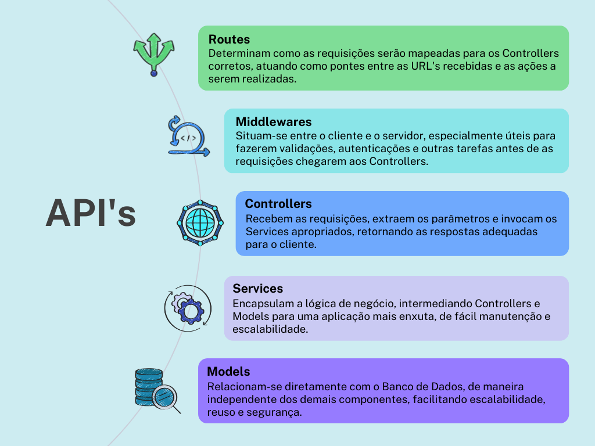
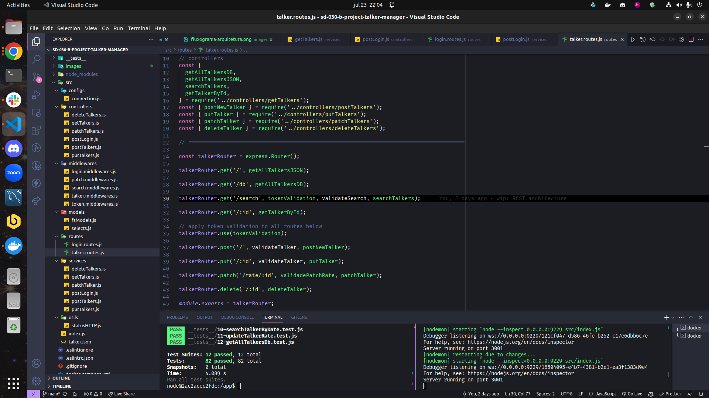

### Rodando o projeto com Docker
Para rodar o projeto utilizando docker, no diretório da aplicação execute o comando:

`docker-compose up -d`

`docker exec -it talker_manager bash`

Para iniciar o servidor com nodemon

`npm run dev`

___

O projeto foi criado para colocar em prática a criação de uma API de palestrantes, permitindo a criação, leitura, atualização e destruição (CRUD) dos dados. Para tanto foi utilizado tanto um arquivo estático `.json` quanto um banco de dados relacional `MySQL`.

## 🧑‍💻 Habilidades Desenvolvidas

  * Criar uma API usando `Express`;

  * Aplicar conceitos de arquitetura baseada em camadas;

  * Criar endpoints para realizar operações _CRUD_;

  * Armazenar os dados, inicialmente, em um arquivo local `.json` com o módulo `fs`;

  * Criar um banco de dados relacional usando o `MySQL`;

  * Estabelecer conexão entre o banco de dados e a API;

---

## 📌 Problema apresentado

A partir de informações sobre palestrantes, foi necessário criar uma API para gerenciar esses dados, permitindo sua criação, leitura, atualização e destruição (CRUD). Os endpoints sensíveis da aplicação necessitam de header com autenticação válida para serem acessados, cujo token é gerado com o método `POST` no endpoint de `login`.:

1. Criar um endpoint que retorne todos os palestrantes cadastrados;

2. Criar um endpoint que permite buscar um palestrante pelo id;

3. Criar um endpoint para gerar o token de autenticação;

4. Criar um endpoint para realizar o login e seus middlewares de validação.

5. Criar um endpoint para cadastrar um novo palestrante;

6. Criar um endpoint para atualizar um palestrante;

7. Criar um endpoint para deletar um palestrante;

8. Criar um endpoint para buscar palestrantes por nome, classificação e data de apresentação utilizando _query params_.;

___
### 📐 Arquitetura baseada em camadas

No desenvolvimento da aplicação, a organização do código seguiu uma abordagem de arquitetura baseada em camadas, tendo em mente uma arquitetura REST para um projeto full-stack.
Para tanto, foram criadas as seguintes camadas:

___

O resultado na arquitetura do código foi o seguinte:

---
## 💻 Tecnologias usadas

  * NodeJS

  * Express

  * Nodemon

  * JavaScript

  * MYSQL

  * Docker
